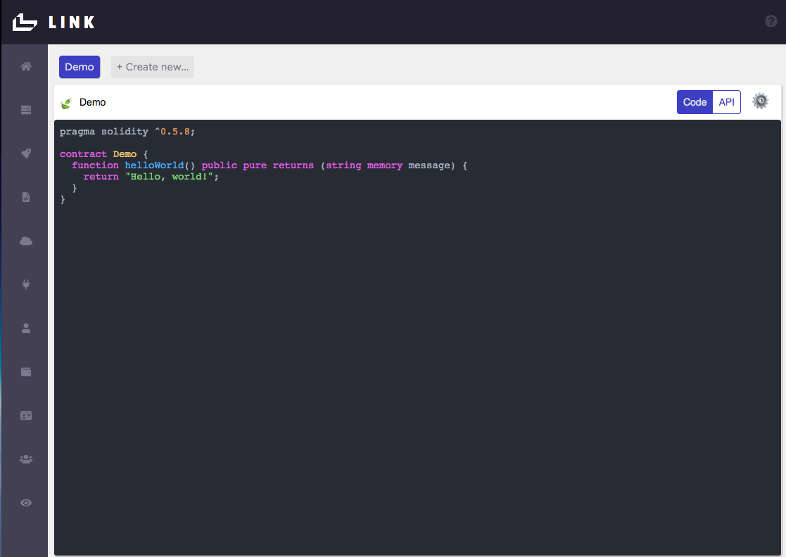
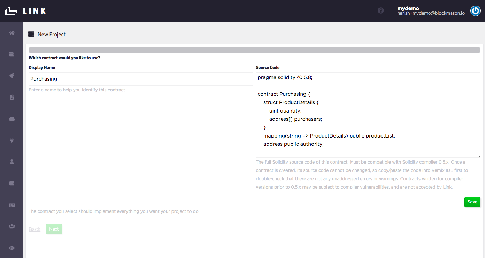
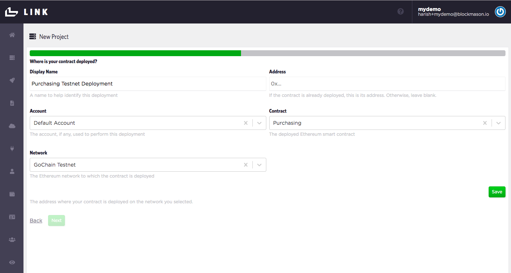
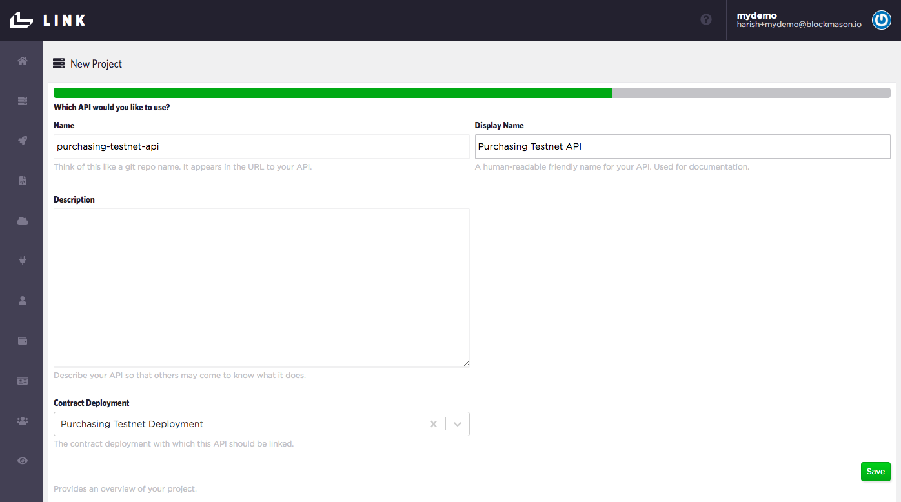
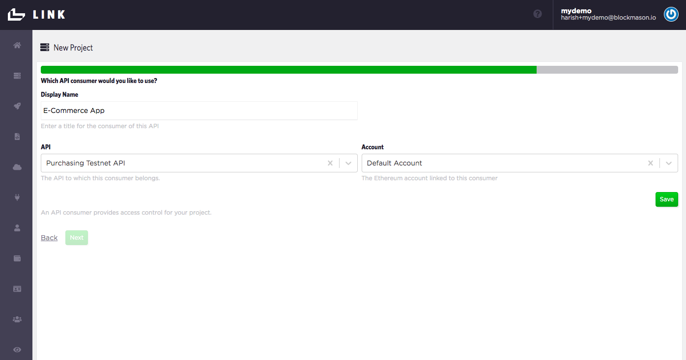
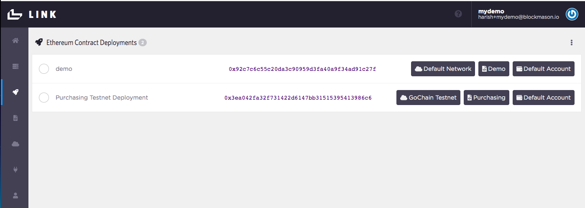

# Create and Deploy Smart Contracts
Goal: Create a 'purchasing' and 'custom token' smart contracts and deploy them to the blockchain. 

### Create a Smart Contract
Smart contracts are essentially lines of code which control the execution of a transaction between blockchain accounts based on events. Smart contracts are regarded as self-executing and intended to avoid the need of intermediaries or 3rd parties.

We will use the Solidity (https://solidity.readthedocs.io/en/latest/) programming language throughout these tutorials to program Ethereum-blockchain compatible smart contracts. **Please refer to this documentation if any Solidity syntax used below is unfamiliar.** 

Solidity has influences from C++, Python and JavaScript and you will see some of the similar syntax used in the following examples. 

#### A 'Purchasing' Smart Contract
In this series, we are going to build a simple **blockchain-powered ecommerce marketplace**, where buyers are limited to only purchase 1 of any item. 

We will start with creating a basic `Purchasing` smart contract to record products, quantity, and buyers on the blockchain.

> Open up the contract template file `contracts/Purchasing-template.sol`. 
```
pragma solidity ^0.5.8;

contract Purchasing {
    event Product(string product, uint quantity, string url, string price, string description, string company, string id);
    struct ProductDetails {
        uint quantity;
        address[] purchasers;
        string url;
        string description;
        string price;
        string company;
        string id;
        bool isSet;
    }
    mapping(string => ProductDetails) public productList;
    address public authority;
  
    constructor() public {
        authority = msg.sender;
    }
    
    ...functions...
}
```
Things to note:
* A `struct` is custom defined object type in Solidity which can group together different types of variables. In this contract, we have a `ProductDetails` custom object which contains a bunch of variables defining the various attributes of the product.

* Events are inheritable members of contracts. When you call them, they cause the arguments to be stored in the transaction’s log - a special data structure in the blockchain. We can access these events from a tool like Blockmason Link. To trigger an event, we use the `emit` keyword followed by the event class. 

* The product details are mapped to a product in the `productList` mapping object, which can be publicly accessed.

* The `authority` of this smart contract will be the address which deploys the contract (i.e. the `msg.sender`). When deploying a contract using Blockmason Link, the Link default wallet is the deploying address and will thus be the contract's `authority`. 

* The functions we need to complete are: `#addProduct()`, `#addProductQuantity()`, `#purchaseProduct()`, and `#getPurchasers()`. 

##### #addProduct()
```
function addProduct(string memory product, uint addQuantity, string memory url, string memory description, string memory price, string memory company, string memory id) public {
    //TODO
}
```
This is the most involved function out of the list, but is still relatively quite simple. We just need to add our arguments to the corresponding `product` in the `productList` mapping. We complete the function by emitting the `Product` event. 

```
function addProduct(string memory product, uint addQuantity, string memory url, string memory description, string memory price, string memory company, string memory id) public {
    productList[product].quantity = addQuantity;
    productList[product].url = url;
    productList[product].price = price;
    productList[product].description = description;
    productList[product].company = company;
    productList[product].id = id;
    productList[product].isSet = true;
    emit Product(product, addQuantity, url, price, description, company, id);
}
```
##### #addProductQuantity()
```
function addProductQuantity(string memory product, uint addQuantity) public {
    //TODO
}
```
Here we want to add quantity to an existing product so we need to first check that the product exists in the `productList` before cumulatively adding the quantity. We will use the `require()` Solidity keyword to check for this requirement first.

```
function addProductQuantity(string memory product, uint addQuantity) public {
    require(productList[product].isSet);
    productList[product].quantity += addQuantity;
}
```

##### #getPurchasers()
```
function getPurchasers(string memory product) public view returns (address[] memory purchasers) {
    //TODO
}
```

Here, we simply need to return the `purchasers` array for a particular `product` from the `productList`:

```
function getPurchasers(string memory product) public view returns (address[] memory purchasers) {
    return productList[product].purchasers;
}
```

##### #purchaseProduct()
```
function purchaseProduct(string memory product, address purchaser) public {
    //TODO
}
```

Here we need to do 2 things:
1. First check if there is product available for purchase. Since each buyer is limited to 1 of any item for our example, we can simply check that the product `quantity` is greater than the length of the `purchasers` array. We will use the `require()` Solidity keyword to check for this requirement first. 

2. Add the buyer to the `purchasers` array for the product. 

```
function purchaseProduct(string memory product, address purchaser) public {
    require(productList[product].purchasers.length < productList[product].quantity);
    productList[product].purchasers.push(purchaser);
}
```
> See the completed smart contract code in `contracts/Purchasing.sol`. 

### Deploy the Purchasing Smart Contract using Blockmason Link
The process for connecting and interacting with external blockchains using Link is relatively straightforward using the Link Project Wizard. In general, the process flow looks something like this:


1. Create your smart contract in Link
2. Label your public blockchain
3. Setup your network connector by identifying the network's public JSON-RPC API endpoint. 
4. Deploy your smart contract onto the public blockchain
5. Label your generated APIs
6. Label your API Consumer (e.g. the name of your app using the APIs)
7. Obtain your OAuth API authentication (automatically generated)

Let us now deploy the `Purchasing.sol` smart contract to a public blockchain. 

> 1. In Link, click on the *`Create new`* button which starts the new project wizard.



> 2. Under *Which contract would you like to use?*, select *`Create new`* and then copy and paste the `Purchasing.sol` code into the *Source Code* field. Set the *Display Name* as `Purchasing`. Press *`Save`* and *`Next`*.



> 3. Under *Which Ethereum account would you like to use?*, use the *`Default Account`*. This is the Link default wallet we seeded with test utility tokens for our specific blockchain as part of the setup. 


> 4. Under *Which network would you like to use?*, select *`Create new`* and name it based on the network you are using. Keep the *Block Confirmations Needed* at 0 (unless you are using a public blockchain Mainnet, in which case use 1) and the default *EVM Version*. Press *`Save`* and *`Next`*.


> 5. Under *Which connector would you like to use?*, select *`Create new`*. Enter in a connector *Display Name* and provide the appropriate network RPC URL. For example, if you are using Ethereum, you can use an [Infura](https://infura.io/) hosted node URL to connect with that network. If you are using GoChain Testnet, you can use the URL `https://testnet-rpc.gochain.io`. See the [Link Onboarding](https://github.com/blockmason/link-onboarding#using-public-blockchains) section on using public blockchains. Ensure you are using the correct *Network* and press *`Save`* and *`Next`*.


> 6. Now we just need to label our Deployment. Under *Where is your contract deployed?*, select *`Create new`*. Call this deployment `Purchasing Testnet Deployment`. Since we **do not have an existing contract deployment**, leave the *Address* field blank. Ensure the *Account* is the `Default Account`, the *Contract* is the `Purchasing` contract and the desired *Network*. Press *`Save`* and *`Next`*.



> 7. Now we are ready to deploy our contract to the desired network. When asked *Are you ready to perform the following deployment?*, press `Deploy` and you should get a deployment in progress indicator icon. This might take a few seconds to complete. If deployed correctly, you will automatically proceed to the next step to setup your API.

**Note: if you get an *insufficient gas fee funds related error, you need to seed your Link default wallet with test utility tokens of your selected blockchain network. Refer to the *Blockchain network token setup* [section of Tutorial 1.](https://github.com/blockmason/ecommerce-workshop/blob/master/Tutorial_1/tutorial_1.md#blockchain-network-token-setup)**


> 8. Now we label our Purchasing contract API. Under *Name*, call it *`purchasing-testnet-api`* Also add in a human-readable display name. Ensure you are using the correct *Contract Deployment*. Press *`Save`* and *`Next`*.



> 9. Now we label our Purchasing API **Consumer**. This is usually the name of the app or service calling the API. For example, let us call the consumer `E-Commerce App`. Ensure you are using the correct *API* and *Account*. Press *`Save`* and *`Next`*.



> 10. Lastly, your consumer needs to authenticate with the Purchasing API. An OAuth2.0 Client Secret is automatically generated. Ensure you are using the correct Principal/Consumer. Press *`Save`*, *`Next`* and then *`Finish`*.


Once you hit *`Finish`*, you should end up back at Home page and see your Purchasing code in the code editor, the API tab and a gear icon which toggles the `client_id` and `client_secret` auth credentials at the bottom of the page. **You will use these credentials to interact with you newly created APIs!**


Also, by clicking on the `Code/API` toggle, you will see the full list of available API endpoints generated from the smart contract code:


**Note: All calls to these API endpoints must be made asynchronously!**

Let us also double check that our Purchasing contract deployed successfully on the blockchain. 

>Click on the `Ethereum Contract Deployments` menu item to see a list of contract deployments and their addresses. In the following example, the contract deployment address is `0x3ea042fa32f731422d6147bb31515395413986c6`



> Copy and paste this address into the selected blockchain's explorer to see the details of your contract deployment.

**Congrats! You have successfully deployed your first smart contract to the blockchain!** 

### Deploy your 'Custom Token' Smart Contract

Following the same steps as before, we will now deploy a custom token which will be used 'under the hood' in our ecommerce marketplace app. 

> In `contracts/`, open up `BasicToken.sol`. Note this is **a simplified contract adapted from the the ERC20 standard token contract** (you can read more about the Ethereum token standard here: https://github.com/ethereum/EIPs/blob/master/EIPS/eip-20.md)

There are only a few customizations you need to do to this contract before deploying it:
```
//Change the contract name to your token name
contract BasicToken {
    // Name your custom token
    string public constant name = "Basic Token";

    // Set your custom token symbol
    string public constant symbol = "BASIC";
```

> Replace `Basic` in the contract definition *and* the public constant `name` variable. 

> Then replace the `BASIC` token symbol with your custom symbol. This will be the token ticker symbol. 

> And then down in the `constructor() public {...` , customize the following lines:
```
// Add your wallet address here which will contain your total token supply
treasury = address(<some address>);

// Use the following for the treasury if you want the Link default account to be the treasury
// treasury = msg.sender;

// Set your total token supply (default 1000)
totalSupply = 1000 * 10**uint(decimals);
```

> So for example if you want to use a custom wallet address, such as `0xFeE9813A4B268793D4Edc6DF11A760C3c07a2c98` as your treasury wallet holding all the custom tokens you will mint, simply change the above line to:
```
treasury = address(`0xFeE9813A4B268793D4Edc6DF11A760C3c07a2c98`);
```

> If you want to use the Link default account as the treasury, delete `treasury = address(<some address>);` and uncomment `treasury = msg.sender;`. 

> Lastly, change the `1000` supply figure to your desired supply amount. 

**Your custom token contract is ready to go!** Follow the previous deployment steps in Blockmason Link to deploy the custom token contract. 

Use the blockchain explorer to confirm you have successfully deployed your token contract. 

In the next tutorial, we will use our Link APIs to interact with both the `Purchasing.sol` and `CustomToken.sol` smart contracts. 
